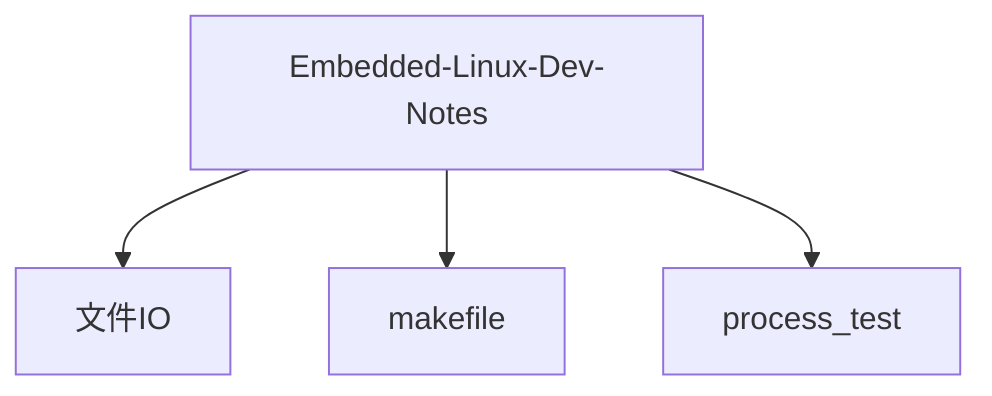

# Embedded-Linux-Dev-Notes

## 项目愿景

本仓库是嵌入式 Linux 应用开发的学习笔记与代码实践集合，参照尚硅谷嵌入式技术之 Linux 应用层开发教程。目标是通过逐步编写 C 语言示例程序，系统掌握 Linux 系统编程的核心知识，包括文件 IO、进程管理、进程间通信、网络编程等主题。

## 架构总览

本项目为学习型仓库，按知识模块分目录组织，每个目录对应一个独立的学习主题，包含若干 C 语言示例源文件和对应的 Makefile 构建脚本。



## 模块索引

| 模块路径 | 语言 | 文件数 | 职责简述 |
|---------|------|-------|---------|
| `文件IO/` | C | 7 | 标准 C 库文件 IO 操作实践(fopen/fclose/fputc/fputs/fprintf/fgetc) |
| `makefile/` | C | 3 | Makefile 编写练习(多文件编译、变量、模式规则) |
| `process_test/` | C | 4 | Linux 进程管理实践(fork/execve/system/文件描述符继承) |

## 运行与开发

### 环境要求

- 操作系统: Linux(WSL2 亦可)
- 编译器: GCC
- 构建工具: GNU Make

### 构建方式

每个模块目录下均有独立的 Makefile，进入对应目录执行:

```bash
# 编译并运行某个示例(以 fopen_test 为例)
cd 文件IO
make fopen_test

# 编译 makefile 模块
cd makefile
make

# 清理 makefile 模块的生成物
cd makefile
make clean
```

> 注意: `文件IO/` 和 `process_test/` 模块的 Makefile 采用"编译-运行-清理"一体化模式，`make` 目标执行后会自动运行程序并删除可执行文件。`makefile/` 模块保留 `.o` 中间文件，需手动 `make clean`。

### 仓库根目录执行

```bash
# 快速验证所有模块(需逐目录进入)
for dir in 文件IO makefile process_test; do echo "=== $dir ===" && cd "$dir" && make && cd ..; done
```

## 测试策略

本仓库为学习笔记型项目，暂无自动化测试框架。每个 `.c` 文件均为独立的可编译、可运行的示例程序，通过观察程序输出和生成的文件内容来验证学习效果。

- 各程序包含详细的函数注释(`@brief`、`@param`、`@return`、`@note`)，记录了对 API 的理解与易错点。
- 部分程序会生成/修改 `io.txt` 文件，可通过查看该文件内容验证写入结果。

## 编码规范

- **语言**: C(GNU C 标准库 + POSIX API)
- **注释风格**: 使用 Doxygen 风格的块注释(`@brief`、`@def`、`@param`、`@return`、`@note`)，详细记录每个标准库函数的原型、参数含义和返回值
- **构建**: 每个模块目录独立 Makefile，使用 GCC 编译
- **Makefile 风格**:
  - `文件IO/` 和 `process_test/`: 使用 `$(CC)` 变量，`-` 前缀忽略错误，目标格式为"编译-运行-删除"
  - `makefile/`: 使用 `objects` 变量、模式规则(`%.o: %.c`)、`clean` 伪目标
- **文件命名**: `{函数名}_test.c`，如 `fopen_test.c`、`fork_test.c`
- **头文件保护**: 使用 `#ifndef/__HELLO_H__/#endif` 传统宏保护

## AI 使用指引

- 本仓库是**学习笔记**，每个 C 文件对应一个或一组 API 的学习实践，代码中包含大量中文注释解释函数用法
- 修改或新增示例时，请保持与现有注释风格一致(Doxygen 风格块注释)
- 新增主题目录时，请参照现有模块结构: 独立 Makefile + 独立 `.c` 示例文件
- 仓库目录名使用中文(如 `文件IO`)，代码文件名使用英文下划线命名

## 变更记录 (Changelog)

| 日期 | 操作 | 说明 |
|------|------|------|
| 2026-05-02 | 初始化 | 首次生成项目 CLAUDE.md，覆盖 3 个模块 |
