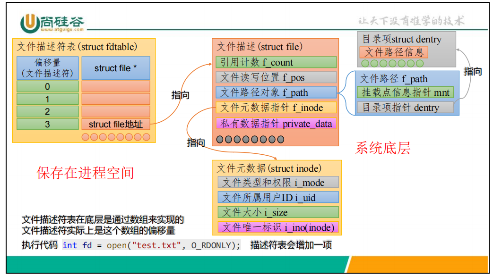

## 文件描述符

### 定义

打开或者创建一个文件（或者套接字）的时候，操作系统会提供一个文件描述符（File Descriptor, FD），非负整数

 - stdin: 0 标准输入
 - stdout: 1 标准输出
 - stderr: 2 标准错误

### 文件描述符的具体结构体


当使用open等系统调用的时候，内核会创建一个新的struct file，这个数据结构记录了文件的元数据（文件类型，权限等）、文件路径、支持的操作等，然后分配文件描述符
文件描述符表中储存着指向struct file的指针，文件描述符就是对应的指针在表中的偏移量

### 文件描述符的分配规则：最小可用

内核为每个进程维护一个文件描述符表（数组），分配新 fd 时，选择**最小的未使用位置**。

```c
// 假设 fd 0, 1, 2 已被 stdin/stdout/stderr 占用
close(STDOUT_FILENO);    // 关闭 fd 1
int fd = open("file.txt", O_WRONLY);  // fd 将被分配为 1（最小可用）
// 这就是 shell 中重定向 "command > file 2>&1" 的原理
```

这也是 `dup()` 系统调用的基础 —— dup 总是返回最小可用的文件描述符。

### 文件描述符的限制

每个进程能打开的文件描述符数量有上限：

| 限制类型 | 说明 | 查看方式 |
|---------|------|---------|
| 单进程限制 | 单个进程最多打开的 fd 数 | `ulimit -n` 或 `getrlimit(RLIMIT_NOFILE)` |
| 系统级限制 | 整个系统最多打开的文件数 | `cat /proc/sys/fs/file-max` |

```bash
# 查看当前单进程 fd 限制
$ ulimit -n
1024

# 临时修改限制
$ ulimit -n 65535

# 查看系统级限制
$ cat /proc/sys/fs/file-max
```

默认单进程限制通常为 1024，可通过 `setrlimit()` 或 `ulimit -n` 调整。

### fork 后的文件描述符继承

`fork()` 创建子进程时，子进程会**复制父进程的文件描述符表**：

- 子进程获得与父进程相同的一组文件描述符
- 父子进程的对应 fd **共享同一个文件表项**（struct file），因此共享文件偏移量
- 一方 read/write 或 lseek 会影响另一方的偏移位置
- 各自 close 互不影响，需要各自关闭

```
父进程                     子进程
  |                          |
  fd 3 ──────┐              fd 3 ──────┐
             │                         │
             └──→ 文件表项 ←────────────┘
                  (共享偏移量)
```

> 实际代码示例见 `process_test/fork_fd_test.c`

### close-on-exec 标志

当进程调用 `exec` 系列函数替换程序映像时，默认所有打开的文件描述符都会保留到新程序中。close-on-exec 标志（`FD_CLOEXEC`）控制某个 fd 在 exec 时是否自动关闭。

```c
#include <fcntl.h>

// 方法1：使用 fcntl 设置 close-on-exec
int flags = fcntl(fd, F_GETFD);
fcntl(fd, F_SETFD, flags | FD_CLOEXEC);

// 方法2（推荐）：在 open 时直接指定 O_CLOEXEC
int fd = open("file.txt", O_RDONLY | O_CLOEXEC);

// 方法3：dup3 (Linux 2.6.27+) 可同时设置 close-on-exec
// dup3(old_fd, new_fd, O_CLOEXEC);
```

为什么需要 close-on-exec：
- 防止文件描述符泄漏到 exec 后的新程序
- 安全编程的最佳实践
- 多线程程序中避免 exec 和 fd 操作之间的竞争（fcntl 不是原子的，O_CLOEXEC 是原子的）

### 文件描述符与 FILE* 的关系

系统调用（文件描述符）和标准 C 库（FILE*）是两套不同层次的接口，可以通过以下函数互相转换：

#### fdopen — 将文件描述符包装为 FILE*

```c
#include <stdio.h>
FILE *fdopen(int fd, const char *mode);
// 将已打开的 fd 包装为 FILE*，之后可使用 fwrite/fread 等标准库函数
// 注意：关闭时应该用 fclose()，它会同时关闭底层的 fd
```

#### fileno — 从 FILE* 获取文件描述符

```c
#include <stdio.h>
int fileno(FILE *stream);
// 从 FILE* 获取底层的文件描述符，可用于 fcntl、lseek 等系统调用
```

#### 对照表

| 操作 | 文件描述符 (fd) | FILE* (流) |
|------|----------------|------------|
| 打开 | `open()` | `fopen()` |
| 读取 | `read()` | `fread()` / `fgets()` / `fgetc()` |
| 写入 | `write()` | `fwrite()` / `fputs()` / `fputc()` |
| 关闭 | `close()` | `fclose()` |
| 定位 | `lseek()` | `fseek()` / `rewind()` |
| 刷新 | 无（无缓冲） | `fflush()` |
| 错误 | `errno` + `perror` | `ferror()` / `feof()` |
| 转换 | `fileno(fp)` → fd | `fdopen(fd, mode)` → fp |
